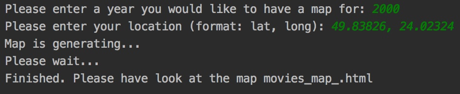
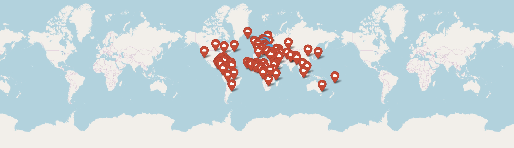
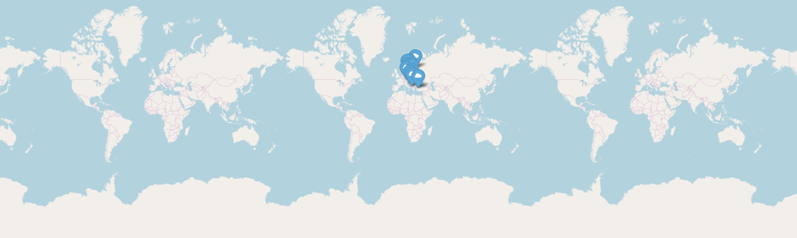
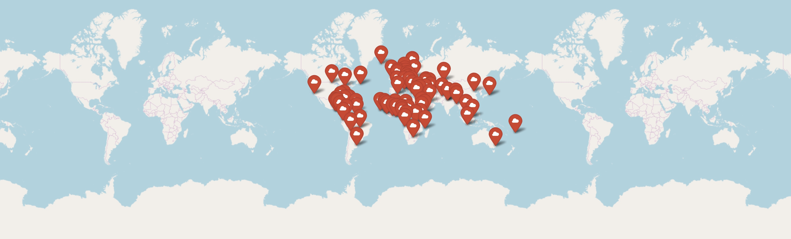

README

1.	Assignment of the module

This module generates a web map. The output of the module is an HTML file, that gives the user an opportunity to get a web map on which he can see the marks of films that were shot in the particular year and location chosen by the user. This map is built on “locations.list” file. It also generates one additional layer: the capitals of all countries in the world.

2.	HTML file structure

<!DOCTYPE html> declaration defines this document to be HTML5.
<head> element contains meta information about the document.
<body> element contains the visible page content.
<meta> provides metadata of a web map.
<link> defines a link between a map and external resources.
<script> includes information about a script.
<style> defines the style of the map.

 defines division of a section on our map.

3.	Conclusion

This web map with geolocation markers of 10 films, that were shot in a year chosen by a user and in the location nearest to the location also chosen by a user. By using it user can assume the nearest places to his location, where films were shot in a particular year.

4. Examples of execution:

